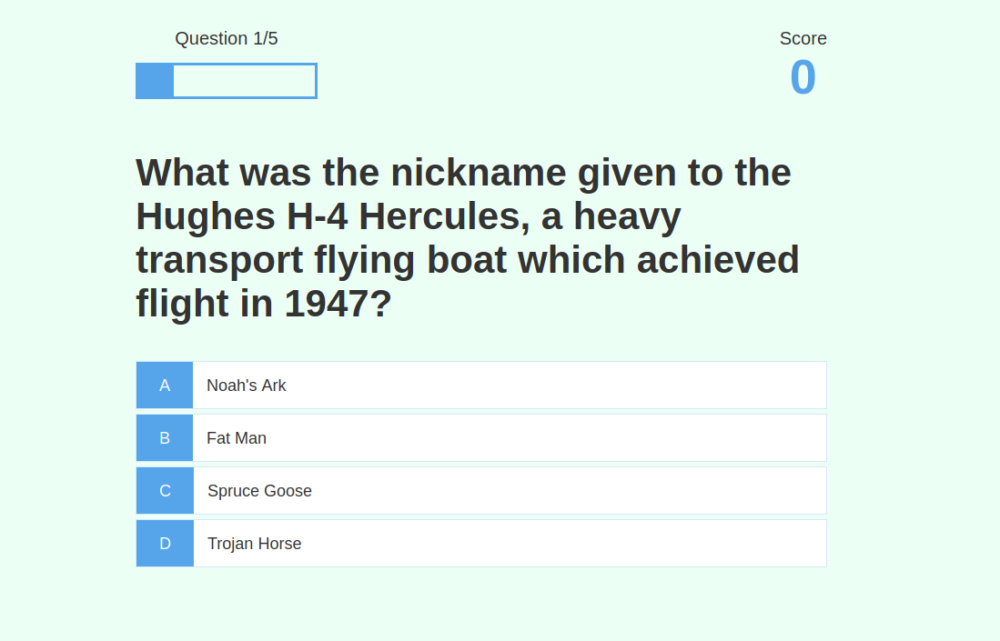
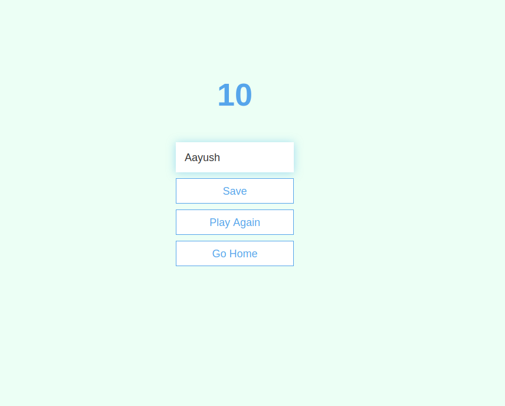
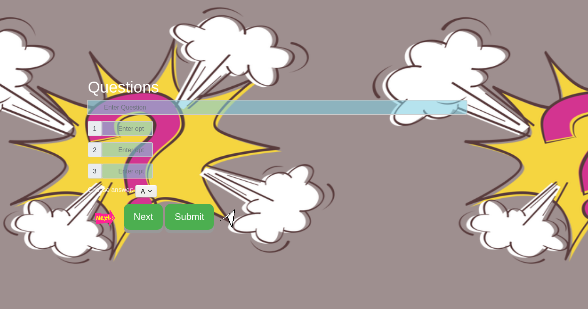

# Real-time-quizApp

real time quiz app is an webapp used to conducta realtime quiz with the students and where facukty can give on spot questions

## Installation
```
1 npm init
2 npm install
```
## Start
```
Node server.js
```
### Tech used 

|**Front-end**:         Html,Css,Js,Bootstrap,Jquery  |<br />
|**Back-end**           Nodejs,Express                |<br />
|**Api & Libraries:**   Socket.io,Pug,Body-parser     |<br />
|**Database:**          Sql                           |

## links for the previous approach


* [RealTime Quiz](https://github.com/aayushhh/Real-time-quizApp)






